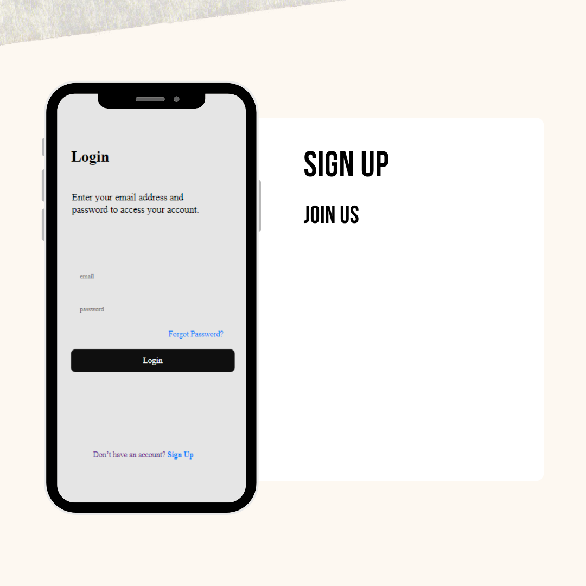

# Project-1-figma

> Layout Login.

### Layout para celular - Login.

A tarefa foi criar um Layout de Login e criar uma README.md

## 🚀 Tecnologias

## 🤝 Colaborador

<table>
  <td>
    <td align="center">
      <a href="#">
         
        
          <b>Selma Dias</b>
        
      </a>
    </td>
    
        
   
 
</table>

[⬆ Voltar ao topo](#Project-1-figma
) 

